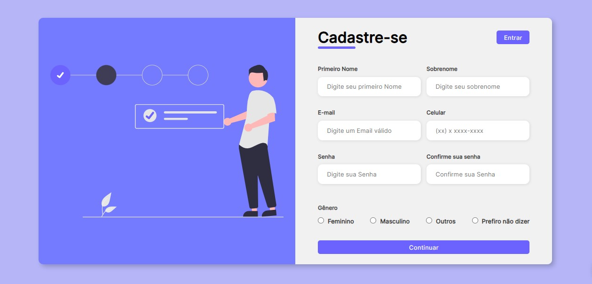
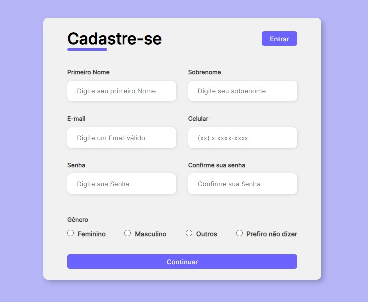
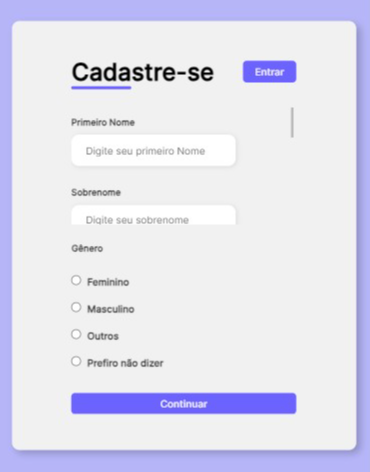

# Formulário Responsivo

##  📋 Índice

- <a href="#sobre-o-projeto">Sobre o Projeto</a>
- <a href="#objetivos">Objetivos</a>
- <a href="#captura-de-tela">Capitura de Tela</a>
- <a href="#linguagens-utilizadas">Linguagens utilizadas</a>
- <a href="#o-que-eu-aprendi">O que eu aprendi</a>
- <a href="#recursos-úteis">Recursos úteis</a>
- <a href="#autor">Autor</a>

##  Sobre o Projeto

 Projeto desenvolvido para estudo da responsividade, formatações dos forms, layout com flexbox e media queries em CSS.

##  Objetivos

- Trabalhar a responsividade
- Estilizar Foumulários

## Captura de tela 
📸

#### Tela Descktop

#### Tela Tablet

#### Tela Mobile

[⬆ Voltar ao topo](#formulário-responsivo) 

## Demonstração

[Link Demontração](<a href="https://responsive-form-2023.netlify.app/">Formulário de Cadastro</a>)

## Linguagens utilizadas
📝
HTML | CSS

###  O que eu aprendi
🤓

- Deixar um formulário Responsivo
- Trabalhar com brack point
- Estilizar Focus do input

[⬆ Voltar ao topo](#formulário-responsivo) 

## Melhorias na alicação

- Inplementar interatividade através do JavaScript

###   Recursos Úteis

Ilustrações em svg
🔧
- <a href="https://undraw.co/illustrations">undraw</a>

[⬆ Voltar ao topo](#formulário-responsivo) 

##   Autor
🧑‍💻

### Vanderlei Junior
- <a href="https://github.com/VanderleiGeronimoJunior">GitHub</a>
- <a href="https://www.linkedin.com/in/vanderlei-junior-b9956686/">Linkedin</a>

[⬆ Voltar ao topo](#formulário-responsivo) 

